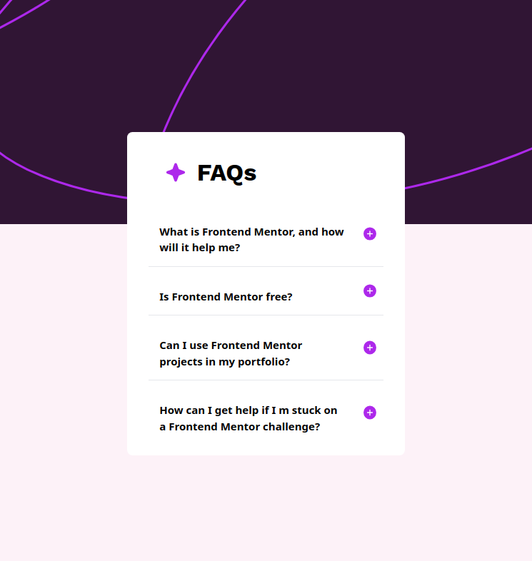

# Frontend Mentor - FAQ accordion solution

This is a solution to the [FAQ accordion challenge on Frontend Mentor](https://www.frontendmentor.io/challenges/faq-accordion-wyfFdeBwBz). Frontend Mentor challenges help you improve your coding skills by building realistic projects. 

## Table of contents

- [Overview](#overview)
  - [The challenge](#the-challenge)
  - [Screenshot](#screenshot)
  - [Links](#links)
  - [Built with](#built-with)
  - [What I learned](#what-i-learned)
  - [Continued development](#continued-development)
  - [Author](#author)

### The challenge

Users should be able to:

- Hide/Show the answer to a question when the question is clicked
- Navigate the questions and hide/show answers using keyboard navigation alone
- View the optimal layout for the interface depending on their device's screen size
- See hover and focus states for all interactive elements on the page

### Screenshot

### Links

- Live Site URL: [FAQ-Acordion](https://faq-accordion-tan-nine.vercel.app/)

### Built with

- Flexbox
- Desktop-first workflow
- [React](https://reactjs.org/) - JS library
- [Tailwind css](https://v3.tailwindcss.com/) - For styles

### What I learned

I learned how to  build reusable components (Accordion and dynamic FAQ items),Managing state (idSelected) with React's useState, conditional rendering,Styling components using Tailwind CSS or your preferred CSS approach and more ...

## Author

- Website - [Mesud Ahmed](https://my-portfolio-kappa-lyart-53.vercel.app/)
- Frontend Mentor - [@Mesud-Ahmed](https://www.frontendmentor.io/profile/Mesud-Ahmed)

